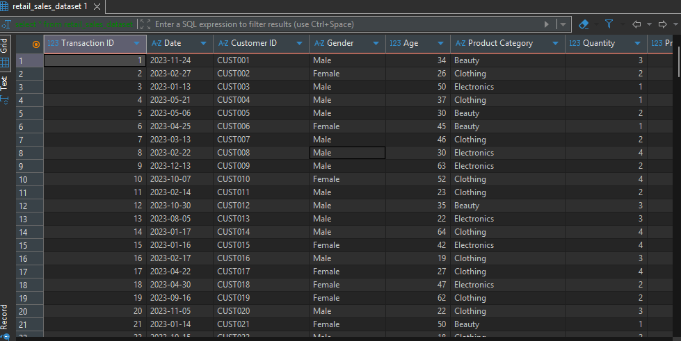
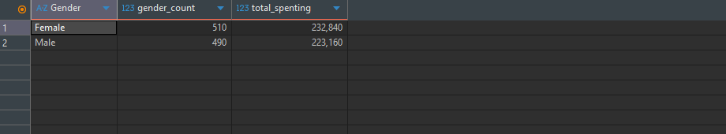
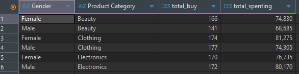
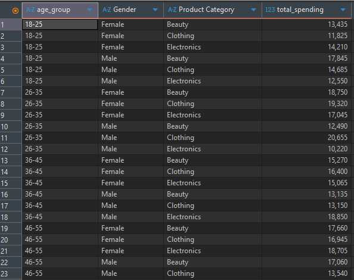
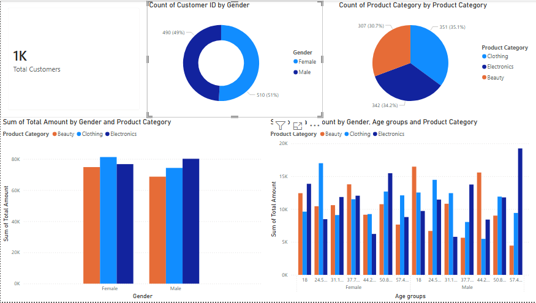

# Retail Sales Analysis (SQL + Power BI)

A short SQL-based analysis of a retail sales dataset, exploring customer
purchasing behavior by gender, age group, and product category. Query
results are visualized in Power BI.

## Dataset
`retail_sales_dataset` — transaction-level retail sales data including
customer gender, age, product category, price per unit, quantity, and total
amount spent per transaction.

## Tools used
- **SQLite** — data querying and aggregation
- **Power BI** — visualization of query results

## Analysis steps

### 1. Data overview
Checked the raw dataset structure before analysis.

### 2. Gender distribution
Counted customers by gender to understand the customer base split.
Result: **510 Female / 490 Male** — a nearly even split.

### 3. Total spend by gender
Aggregated total spend per gender to see who contributes more revenue overall.
Result: **Female $232,840 / Male $223,160** — spend is fairly balanced
between genders, tracking closely with the near-even customer count.

### 4. Spend & frequency by gender + product category
Broke spend and purchase frequency down further by product category, to see
which categories each gender buys most often and spends the most on.

### 5. Spend by age group + gender + product category
Bucketed raw customer age into ranges (18-25, 26-35, 36-45, 46-55, 56+) and
combined with gender and product category to see which combinations drive
the most revenue. Product category is included in the `GROUP BY` here, so
each row reflects a real slice of spend within one specific category
(rather than a combined total across all categories).

All queries are in [`retail_sales_analysis.sql`](./retail_sales_analysis.sql).

## Key insights
- **Electronics** generated the highest total spend for both genders, despite
  not having the highest purchase count — suggesting higher-value purchases
  per transaction in this category.
- **Clothing** had the highest purchase frequency for both genders, though
  spend per transaction was comparatively lower than Electronics.
- Gender-level spend is closely balanced overall (Female $232,840 vs Male
  $223,160), tracking the near-even 510/490 customer split.
- Within age groups, some standout combinations emerge — e.g. **26-35 Male**
  customers show notably high Clothing spend, and **36-45 Male** customers
  show a spend spike in Electronics relative to other categories in that
  same age group.
- *(Add: whether each category's revenue is driven more by volume or
  price-per-unit, based on query 6 results)*

## Power BI Dashboard
Query results are visualized in a Power BI dashboard covering:
- Total customer count and gender split
- Transaction count and revenue by product category
- Revenue by gender and product category
- Revenue by age group, gender, and product category
- *(Add once built: units sold vs revenue by category)*

**Note:** the dashboard's age groups currently use Power BI's automatic
equal-width binning (e.g. 20s, 30s, 40s), while the SQL analysis uses custom
ranges (18-25, 26-35, etc.). These don't match exactly yet — matching them
would require adding a calculated column in Power BI, which is a planned
next step.

## Next steps
- Add average order value (`total_spending / total_buy`) per gender/category
- Align the Power BI age groups with the SQL's custom age ranges
- Explore monthly/yearly sales trends (if multiple years become available)
- Finish building out the units-sold visual in Power BI
